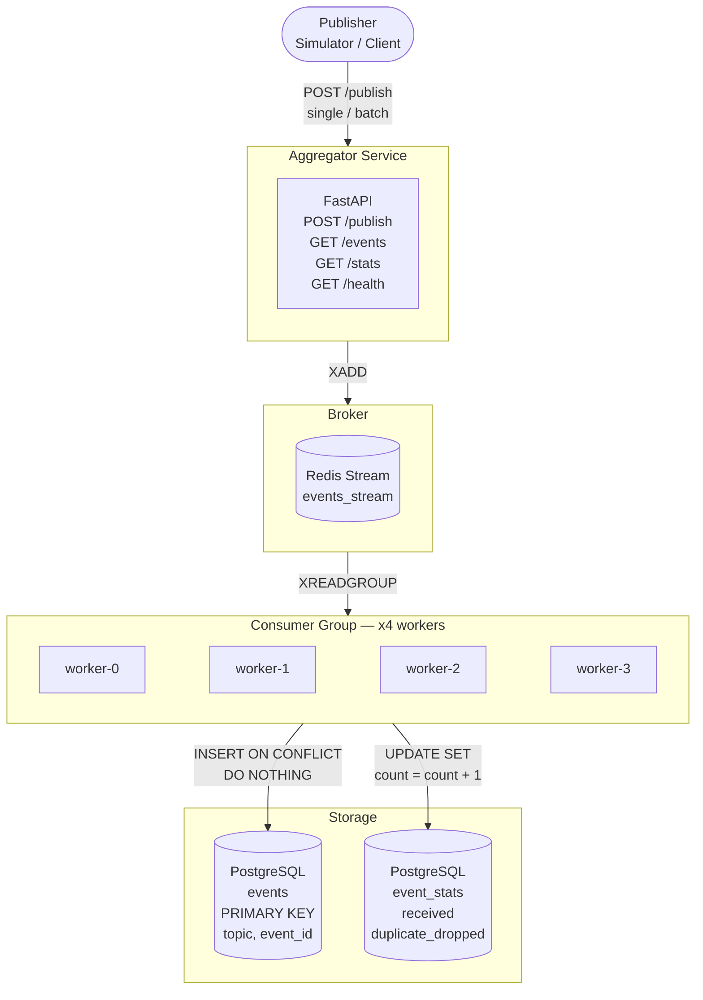

# Laporan UAS Sistem Terdistribusi

**Nama Program Studi:** Sistem Terdistribusi
**Judul Proyek:** Pub-Sub Log Aggregator Terdistribusi dengan Idempotent Consumer, Deduplication, dan Transaksi/Kontrol Konkurensi
**Teknologi Utama:** Python 3.11, FastAPI, asyncio, Redis Stream, PostgreSQL 16, Docker Compose

---

## 1. Deskripsi dan Arsitektur Sistem

### 1.1 Deskripsi Sistem

Sistem ini adalah layanan agregasi log berbasis pola **Publish-Subscribe** yang dibangun menggunakan Python (FastAPI + asyncio). Publisher mengirimkan event melalui HTTP ke endpoint `POST /publish`. Event kemudian didistribusikan ke **Redis Stream** sebagai antrean persisten, lalu dikonsumsi secara paralel oleh 4 *worker* asinkron. Setiap worker melakukan deduplikasi berbasis constraint unik `(topic, event_id)` di PostgreSQL dengan instruksi `INSERT ... ON CONFLICT DO NOTHING`. Endpoint `GET /events` dan `GET /stats` menyediakan akses baca ke data yang telah diproses.

Sistem dirancang untuk memenuhi tiga kriteria utama sistem terdistribusi sebagaimana didefinisikan van Steen & Tanenbaum (2023): **transparansi distribusi**, **skalabilitas konkurensi**, dan **toleransi kegagalan**.

### 1.2 Arsitektur Sistem



### 1.3 Alur Pemrosesan

1. **Publisher** mengirim satu atau sekumpulan event ke `POST /publish`
2. **FastAPI** memvalidasi skema event via Pydantic (422 otomatis jika schema salah)
3. Event yang valid di-push ke **Redis Stream** (`XADD events_stream`)
4. **4 Worker Consumer** membaca stream via `XREADGROUP` — setiap pesan hanya dikirim ke satu worker
5. Setiap worker mengeksekusi `INSERT INTO events ... ON CONFLICT (topic, event_id) DO NOTHING` di PostgreSQL
6. Jika event baru → tersimpan, `unique_processed` naik; jika duplikat → diabaikan, `duplicate_dropped` naik
7. Statistik diperbarui secara transaksional: `UPDATE event_stats SET received = received + 1`
8. `GET /events` membaca dari PostgreSQL; `GET /stats` membaca dari tabel `event_stats`

---

## 2. Keputusan Desain

### 2.1 Idempotency & Deduplication

Idempotency adalah sifat di mana sebuah operasi menghasilkan kondisi akhir yang sama meskipun dieksekusi lebih dari satu kali (van Steen & Tanenbaum, 2023). Dalam pola *at-least-once delivery*, satu event dapat dikirim lebih dari satu kali, sehingga sifat ini menjadi krusial.

**Implementasi:**

```sql
-- src/dedup_store.py
INSERT INTO events (topic, event_id, timestamp, source, payload, processed_at)
VALUES ($1, $2, $3, $4, $5, NOW())
ON CONFLICT (topic, event_id) DO NOTHING
```

Operasi ini bersifat atomik di level database. Jika `(topic, event_id)` sudah ada sebagai *PRIMARY KEY*, PostgreSQL mengabaikan operasi tersebut tanpa melempar exception, menjadikan seluruh pipeline **idempoten secara alami**.

| Kondisi | Aksi PostgreSQL | Aksi Worker |
|---|---|---|
| Event baru — belum ada | INSERT berhasil, `rowcount > 0` | Catat sebagai `unique_processed` |
| Event duplikat — sudah ada | INSERT diabaikan, `rowcount = 0` | Catat sebagai `duplicate_dropped`, log WARNING |

### 2.2 Broker & Dedup Store

**Pertimbangan pemilihan teknologi:**

| Komponen | Teknologi | Alasan Dipilih |
|---|---|---|
| **Message Broker** | Redis 7 Stream | Consumer Group memungkinkan N worker membagi pesan secara eksklusif; persisten via volume |
| **Dedup Store** | PostgreSQL 16 | ACID, row-level locking, constraint unik atomik; mendukung transaksi konkurensi tinggi |
| **Skema tabel** | PRIMARY KEY `(topic, event_id)` | Composite key memungkinkan `event_id` yang sama di topic berbeda dianggap unik (namespace terpisah) |

**Skema database yang digunakan:**

```sql
CREATE TABLE events (
    topic        TEXT NOT NULL,
    event_id     TEXT NOT NULL,
    timestamp    TIMESTAMPTZ,
    source       TEXT,
    payload      JSONB,
    processed_at TIMESTAMPTZ DEFAULT NOW(),
    PRIMARY KEY (topic, event_id)
);

CREATE TABLE event_stats (
    id                SERIAL PRIMARY KEY,
    received          BIGINT DEFAULT 0,
    unique_processed  BIGINT DEFAULT 0,
    duplicate_dropped BIGINT DEFAULT 0,
    last_updated      TIMESTAMPTZ DEFAULT NOW()
);
```

### 2.3 Transaksi & Kontrol Konkurensi

Coulouris et al. (2011) menjelaskan bahwa transaksi menyediakan mekanisme untuk mengeksekusi sekumpulan operasi secara atomik (ACID), memastikan konsistensi meski terjadi *crash* atau intervensi konkuren.

**Masalah yang diatasi: Lost-Update pada statistik**

Tanpa transaksi yang tepat, dua worker yang membaca nilai `received = 10` secara bersamaan masing-masing akan menuliskan `11`, bukan `12`. Solusinya adalah mendelegasikan kalkulasi ke database:

```sql
-- Bukan: baca → tambah di Python → tulis (rawan lost-update)
-- Melainkan: delegasikan ke database
UPDATE event_stats
SET
    received          = received + $1,
    unique_processed  = unique_processed + $2,
    duplicate_dropped = duplicate_dropped + $3,
    last_updated      = NOW()
WHERE id = 1
```

PostgreSQL menjalankan `READ COMMITTED` (default) yang memicu *row-level lock* saat `UPDATE`. Ini menjamin operasi dari worker-worker paralel dieksekusi secara serial oleh database tanpa kehilangan satu pun penghitungan.

**Kontrol konkurensi saat insert paralel:**

Ketika 4 worker menerima event yang sama secara bersamaan dari Redis (karena retry), PostgreSQL menempatkan *lock* pada indeks unik untuk transaksi tercepat. Tiga lainnya mendeteksi konflik dan klausa `DO NOTHING` meredam konflik ini tanpa error. *Race condition* dinetralisir tanpa *distributed lock* eksternal.

**Isolation level yang dipilih: READ COMMITTED**

| Level | Trade-off | Pilihan |
|---|---|---|
| READ COMMITTED | Tidak ada *phantom reads* pada pola insert-only; *row-level lock* cukup untuk UPDATE atomik | ✓ Dipilih |
| SERIALIZABLE | Lebih aman tapi overhead tinggi; tidak diperlukan untuk pola idempotent upsert | ✗ |

### 2.4 Ordering

Van Steen & Tanenbaum (2023) menjelaskan bahwa *totally-ordered multicasting* menjamin urutan yang sama di semua proses namun biaya koordinasinya tinggi. Dalam sistem agregator log ini, setiap event bersifat **independen** — tidak ada dependensi kausal antar event dari sumber berbeda — sehingga total ordering **tidak diperlukan**.

| Aspek Ordering | Implementasi | Justifikasi |
|---|---|---|
| **Partial ordering** | Redis Consumer Group + FIFO per worker | Pesan dalam satu stream diproses berurutan per worker |
| **Timestamp sumber** | Field `timestamp` ISO 8601 dari publisher | Referensi waktu sisi pengirim |
| **Urutan penyimpanan** | `ORDER BY processed_at` di PostgreSQL | Mencerminkan urutan pemrosesan aktual |

### 2.5 Strategi Retry & At-Least-Once Delivery

Sistem mengadopsi semantik **at-least-once delivery** (Coulouris et al., 2011). Endpoint `POST /publish` selalu merespons HTTP 200 dan memasukkan event ke Redis. Publisher bebas melakukan retry tanpa khawatir data duplikasi merusak state, karena *idempotent consumer* menanganinya di level database.

*Exactly-once delivery* sangat sulit tanpa two-phase commit. Dengan *idempotent consumer*, **at-least-once secara efektif menghasilkan exactly-once semantics** dalam hal keunikan data yang tersimpan.

---

## 3. Analisis Performa

### 3.1 Hasil Stress Test

Pengujian dilakukan dengan `publisher.py` yang mengirim **25.000 event (16.250 unik + 8.750 duplikat / 35%)** secara paralel via `asyncio`.

| Metrik | Nilai |
|---|---|
| Total event dikirim | 25.000 |
| Event unik tersimpan | 16.250 |
| Duplikat terdeteksi & dibuang | 8.750 |
| Duplicate rate | 35% |
| Waktu total eksekusi | ~117 detik |
| Throughput publish ke Redis | ~222 events/detik |
| Worker count | 4 paralel |
| Konsistensi data akhir | ✓ `unique + dropped == received` |

### 3.2 Faktor Performa

**Mengapa tetap konsisten di bawah beban tinggi?**

1. **Decoupling via Redis Stream** — `POST /publish` hanya meng-XADD ke stream; tidak menunggu I/O database. Publisher mendapat respons dalam hitungan milidetik.
2. **Consumer Group** — 4 worker membagi beban secara merata; satu pesan hanya diproses oleh satu worker.
3. **Atomik di level database** — Konflik duplikat tidak menyebabkan rollback transaksi mahal; `DO NOTHING` sangat ringan.

**Profil latensi:**

| Operasi | Latensi Estimasi |
|---|---|
| `POST /publish` (XADD ke Redis) | ~1–5 ms |
| Worker → PostgreSQL INSERT | ~5–15 ms |
| `GET /events` (SELECT dari PostgreSQL) | ~10–30 ms (tergantung volume) |
| `GET /stats` (SELECT dari event_stats) | ~2–5 ms |

---

## 4. Keterkaitan Teori dan Implementasi

| Bab | Topik Utama | Keputusan Desain | Referensi Kode |
|---|---|---|---|
| Bab 1 | Karakteristik & trade-off | Availability > strong consistency; event-driven decoupling | [`src/main.py`](src/main.py) |
| Bab 2 | Arsitektur Pub-Sub | Referential & temporal decoupling via Redis Stream | [`src/consumer.py`](src/consumer.py) |
| Bab 3 | Komunikasi & proses | HTTP/JSON; asyncio coroutine; Docker container isolation | [`src/main.py`](src/main.py) |
| Bab 4 | Penamaan | Composite PK `(topic, event_id)`; UUID4 collision-resistant | [`src/dedup_store.py`](src/dedup_store.py) |
| Bab 5 | Ordering | Partial ordering FIFO; total ordering tidak diperlukan | [`src/consumer.py`](src/consumer.py) |
| Bab 6 | Toleransi kegagalan | Retry + backoff; durable broker (Redis volume); crash recovery via PostgreSQL | [`src/consumer.py`](src/consumer.py) |
| Bab 7 | Eventual consistency | Idempotent consumer memastikan konvergensi; `DO NOTHING` sebagai safeguard | [`src/dedup_store.py`](src/dedup_store.py) |
| Bab 8 | Transaksi & ACID | `UPDATE SET count = count + 1` — row-level lock; READ COMMITTED isolation | [`src/stats.py`](src/stats.py) |
| Bab 9 | Kontrol konkurensi | `INSERT ON CONFLICT DO NOTHING` — atomik; tanpa distributed lock | [`src/dedup_store.py`](src/dedup_store.py) |
| Bab 10–13 | Orkestrasi & observabilitas | Docker Compose; healthcheck readiness; named volumes; audit logging | [`docker-compose.yml`](docker-compose.yml) |

---

## 5. Unit & Integration Tests

Sistem memiliki **18 unit/integration tests** yang mencakup semua area fungsional:

| # | Nama Test | Cakupan | File |
|---|---|---|---|
| 1 | `test_events_endpoint_returns_processed_events` | GET /events mengembalikan event unik | [`tests/test_api.py`](tests/test_api.py) |
| 2 | `test_events_endpoint_all_topics` | Filter topic bekerja | [`tests/test_api.py`](tests/test_api.py) |
| 3 | `test_stats_consistency_after_publish` | Stats konsisten setelah publish | [`tests/test_api.py`](tests/test_api.py) |
| 4 | `test_stats_empty_initial` | Stats awal = 0 | [`tests/test_api.py`](tests/test_api.py) |
| 5 | `test_health_endpoint` | GET /health mengembalikan ok | [`tests/test_api.py`](tests/test_api.py) |
| 6 | `test_race_condition_unique_constraint` | 100 coroutine paralel → hanya 1 tersimpan | [`tests/test_concurrency.py`](tests/test_concurrency.py) |
| 7 | `test_isolation_level_no_lost_update` | Multi-worker UPDATE tidak lost-update | [`tests/test_concurrency.py`](tests/test_concurrency.py) |
| 8 | `test_dedup_rejects_duplicate` | Duplikat di-drop, unique tetap 1 | [`tests/test_dedup.py`](tests/test_dedup.py) |
| 9 | `test_same_event_id_different_topics` | event_id sama, topic beda = 2 unique | [`tests/test_dedup.py`](tests/test_dedup.py) |
| 10 | `test_consumer_dedup_integration` | Pipeline consumer + dedup end-to-end | [`tests/test_dedup.py`](tests/test_dedup.py) |
| 11 | `test_dedup_persistence_across_reconnect` | Dedup tahan setelah reconnect DB | [`tests/test_persistence.py`](tests/test_persistence.py) |
| 12 | `test_valid_event_schema` | Event valid → 200 OK | [`tests/test_schema.py`](tests/test_schema.py) |
| 13 | `test_missing_topic_field` | Missing `topic` → 422 | [`tests/test_schema.py`](tests/test_schema.py) |
| 14 | `test_missing_event_id_field` | Missing `event_id` → 422 | [`tests/test_schema.py`](tests/test_schema.py) |
| 15 | `test_invalid_timestamp_format` | Timestamp salah → 422 | [`tests/test_schema.py`](tests/test_schema.py) |
| 16 | `test_empty_body` | Empty body → 422 | [`tests/test_schema.py`](tests/test_schema.py) |
| 17 | `test_batch_publish` | Batch event → diterima semua | [`tests/test_schema.py`](tests/test_schema.py) |
| 18 | `test_stress_20000_events_with_duplicates` | 20k events + 30% duplikat, konsisten | [`tests/test_stress.py`](tests/test_stress.py) |

```bash
# Setup: pastikan stack Docker berjalan
docker compose up -d aggregator broker storage

# Jalankan semua tests (kecuali stress test berat)
source .venv/bin/activate
pytest tests/ -v --ignore=tests/test_stress.py

# Semua tests termasuk stress test
pytest tests/ -v
```

---

## 6. Informasi Proyek

| Item | Detail |
|---|---|
| **Framework** | FastAPI 0.104+ dengan Python 3.11 |
| **Dedup Store** | PostgreSQL 16 (`asyncpg` pool, `ON CONFLICT DO NOTHING`) |
| **Message Broker** | Redis 7 (Stream + Consumer Group, 4 workers) |
| **Stats Store** | PostgreSQL (transaksional `UPDATE SET count = count + 1`) |
| **Testing** | pytest + pytest-asyncio (18 tests) |
| **Container** | `python:3.11-slim`, non-root user (`appuser`) |
| **Docker Compose** | 4 service: aggregator, publisher, broker, storage |
| **GitHub** | https://github.com/user312982/pub-sub-idempotent |
| **Video Demo** | https://youtu.be/F1YnoWiaz-M |

---

## Daftar Pustaka

Coulouris, G., Dollimore, J., Kindberg, T., & Blair, G. (2011). *Distributed systems: Concepts and design* (5th ed.). Addison-Wesley.

van Steen, M., & Tanenbaum, A. S. (2023). *Distributed systems* (4th ed.). Maarten van Steen.

FastAPI. (2024). *FastAPI documentation*. https://fastapi.tiangolo.com/

Python Software Foundation. (2024). *asyncio — Asynchronous I/O*. https://docs.python.org/3/library/asyncio.html

PostgreSQL Global Development Group. (2024). *PostgreSQL 16 documentation*. https://www.postgresql.org/docs/16/
